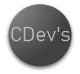

# *Resolução De Desafios* 👌
_Portugol_
---
#### Este Repositório Consiste Em Aprender Mais Sobre As Funcionalidades Do ( **Portugol Studio** ) E Lidar Com **Exercícios** Que São Bem Desafiadores Para Quem Esta Aprendendo Programação 
---

`ID` | `Exercicio` | `Versão`
---|---|---
```
01 |
28 |
29 |
30 |
---
```


## Perfis De Contato 

* 📄 Linkedin: [Rener Augusto](https://www.linkedin.com/in/rener-augusto-alves-farias-takahashi-258065303/)
* 📄 GitHub : [CDevTak](https://github.com/CdevTak)
* 📄 Facebook : [Renan Takahashi]()
* 📄 Instagram : [Renantaks](https://www.instagram.com/renantaks/)
* 📄 DIO TechWeek : [Rener Augusto](https://www.dio.me/users/reneraugusto812) 




```
Att.Renan Takahashi
```  
